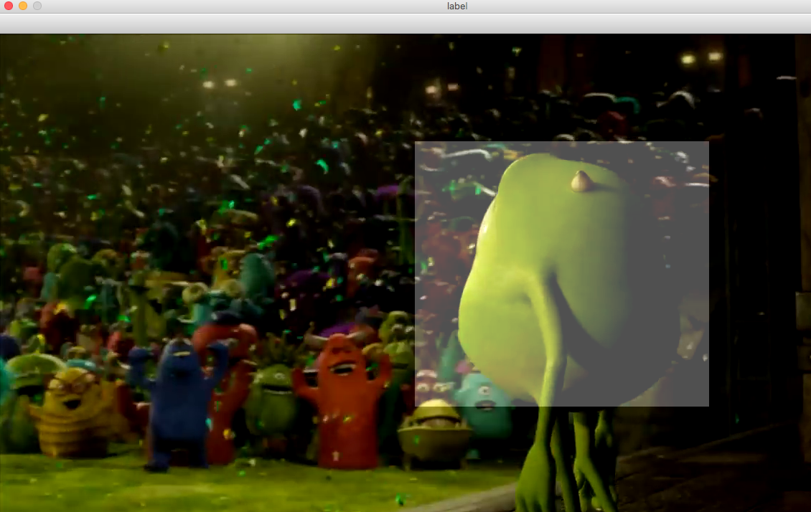

Simple bounding box labeling tools from video frame
-----------------------------------

### Get started
 
 Install the requirement library to run the code
````
pip install requirements.txt 
````

### Run the Code

#### Extracting video frame
From the directory, run the extract_video_frame.py, give -v the video path which you want to extract the frame, 
while -t is the target path where you want the frame to save to.
````
python util/extract_video_frame.py -v data/video -t data/frame
````

#### Labeling 
From the directory, run label_dataset.py, supply -dp for the dataset_path where your image store, and -sp for 
the save_path where the label you want to save to.

```
python util/label_dataset.py -dp data/frame -sp data/label
```
Label will be saved as dict in **numpy** format. e.g: **{'y': 10, 'x': 20, 'w': 300, 'h': 300}** 

### Screenshot



